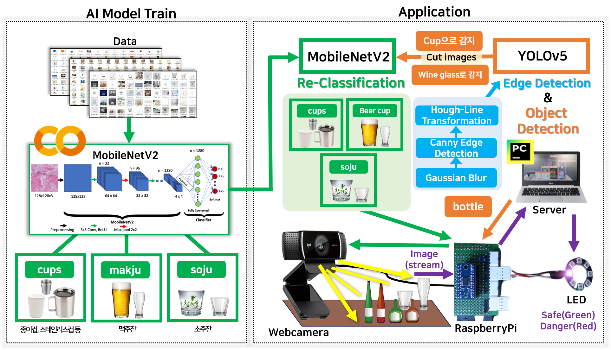

# Glass_Defender_pj
**<h3>[AIot Project]</h3>** 

**Team name** : Glass Defender

**Team member** : jahyeon Kwon, Garin Lee

**Topic** :
- Using the camera of the tablet PC in the restaurant "to prevent glass and glass bottles from falling"
  
   (Modified **YOLOv5** and **MobileNetV2** with transfer learning, Utilizing **RaspberryPi**)

**image_crawling**  

• crawling_google&naver(JupyterNotebook) : Crawling codes that collects images from Google and Naver  
  (cups, beer cups, soju cups)  
 

**models**  

• models_comparision (PyCharm) : Compare inference speeds and resource usage for three CNN models  
  (VGG-16, ResNet-50, MobileNetV2)  
  
• MobileNetV2 (Colab) : Transfer Learning Using MobileNetV2  

• MobileNetV2_test (PyCharm) : Test the learning model to assess accuracy and loss  
 

**desk_edge_save**  

• Extracting table contours with OpenCV (cv2)  
 

**edge_detection**  

• Output to table contours and RedLine screens  
 

**glass_defender**  

• Real-time object detection (YOLOv5) and classification (MobileNetV2) are performed to control LEDs based on detection of fragile objects  
 

**request_exm**  

• Running a server  
